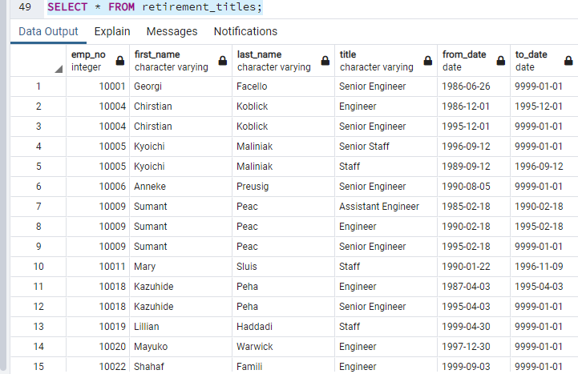
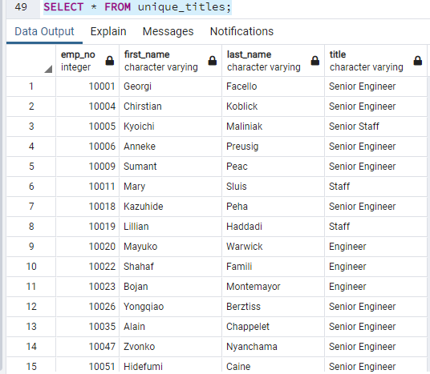
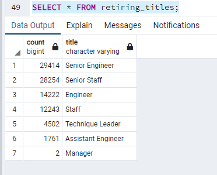
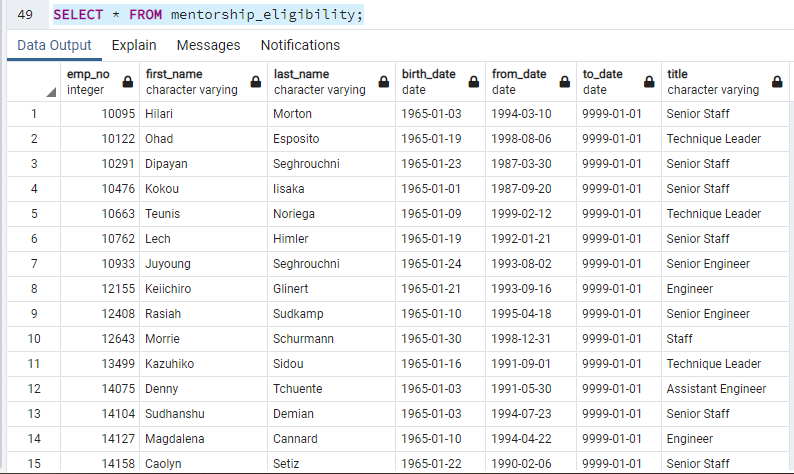

# Pewlett Hackard Analysis
In this challenge, we build further analysis off of our previous module work. Now, Pewlett Hackard is asking for additional assignments. First, they would like for me to determine the number of retiring employees per title and provide a count of how many people will be retiring per title. Second, they would like to identify senior employees who would be eligible to participate as mentors in a new mentorship program. From the provided data, we can certainly find what they are asking for.

## Results
We were able to find the initial list of who is about to retire using a join of the employees data and the titles data. Applying a filter allowed us to retrieve the names of everyone born between 1952 and 1955 along with their titles. What I retrieved is below:

However, this table contained duplicate employees if they have held more than one position at Pewlett Hackard. To remove the duplicate names and only display their current role, I used the DISTINCT ON statement to only display the most recent position. This provided a table with no duplicates and only active roles:

Finally, with only active data and no duplicates, I did a count of each title to determine how many people holding specific titles were about to retire. What I retrieved is below: 

The second set of data that was requested is a list of people who were born in 1965. These individuals are eligible to be involved in a new mentorship program. Similar to the previous steps, I needed to join the employees, department employee and titles data to get what we needed. Using DISTINCT ON, I was again able to only display the most recent titles and remove duplicate names from the list. Finally, I filtered the data to only display names who were born in 1965 and filter it further to ensure only active employees were displayed. Below is the result:

## Summary
Based off the data:
1. There are many roles that will need to be filled soon as people begin to retire. In fact, 90,398 roles will need to be filled, which is a substantial amount of roles.
2. From the data I pulled, there 1549 people that qualify to be mentors. Simply put, that is not enough mentors to equip the next generation within Pewlett Hackard. It is, however, a good number of mentors that could be assigned to younger top candidates to prioritize propping up younger leadership. PH should not abandon the mentor program, but they should look for something to supplement it with.
3. 
